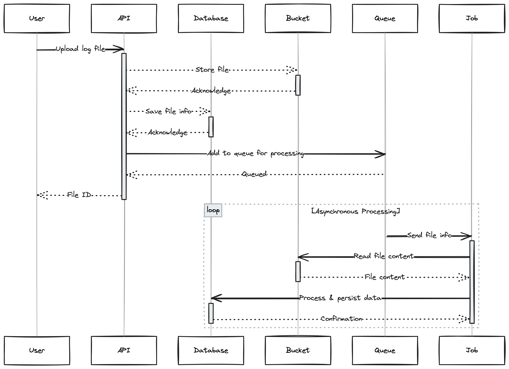

# Quake Log API

## Introduction

The Quake Log API is a powerful tool that enables in-depth analysis of Quake III Arena game server logs, generating comprehensive reports on matches, players, and kills.

## Features

### Authentication with JWT

The Quake Log API incorporates JWT (JSON Web Token) authentication for secure user access. The authentication process involves obtaining a token by making a request to the following routes:

- `POST - /api/v1/users`: Allows users to register and create an account.
- `POST - /api/v1/auth`: Enables users to log in and obtain the JWT token.

These routes are intentionally open and do not require authentication, allowing users to register and obtain the necessary token to access other routes securely.

Once a user successfully logs in and obtains the JWT token, they can include this token in the headers of subsequent requests to protected routes. The API will then validate the token, granting access to the authorized features.

This JWT-based authentication ensures a secure and controlled environment, allowing users to leverage the full functionality of the Quake Log API while maintaining data integrity and privacy.

### Upload of Log Files

The file upload process is carried out through the `POST - /api/v1/files/upload` endpoint. The API receives the file, stores it in a folder on the server (simulating a Bucket), persists the file information in the database, and adds it to an internal queue for asynchronous processing through a Job. This Job extracts the information from the file in the queue, reads the file content in the simulated Bucket (folder `./uploads`), and processes the log data (matches, kills, players), persisting them in the database.



### Match Reports

Based on the uploaded data, comprehensive reports can be generated about games, scores, players, and kills. This data can be retrieved for a specific game or file. Examples below:

**1. List of kills in a match**

`GET - /api/v1/games/:gameId/kill-feed`

**Example response:**

```json
[
  "The player \"Isgalamido\" killed the player \"Mocinha\" using the Rocket weapon.",
  "The player \"Zeh\" died because he was wounded and fell from a height enough to kill him.",
  "The player \"Dono da Bola\" died because he fallen from a significant height."
]
```

**2. Kills by players in a file (separated by games)**

`GET - /api/v1/files/:filesId/kills-by-players`

**Example response:**

```json
{
  "game1": {
    "totalKills": 11,
    "players": [
      "Isgalamido",
      "Dono da Bola",
      "Mocinha"
    ],
    "kills": {
      "Isgalamido": 0,
      "Dono da Bola": 0,
      "Mocinha": 0
    }
  },
  "game2": {
    "totalKills": 4,
    "players": [
      "Dono da Bola",
      "Mocinha",
      "Isgalamido",
      "Zeh"
    ],
    "kills": {
      "Dono da Bola": 0,
      "Mocinha": 0,
      "Isgalamido": 1,
      "Zeh": 0
    }
  }
}
```

Note: The same data can also be obtained by searching for a specific match at `GET - /api/v1/games/:gameId/kills-by-players`.

**3. Kills by means in a file (separated by games)**

`GET - /api/v1/files/:filesId/kills-by-means`

**Example response:**

```json
{
  "game2": {
    "killsByMeans": {
      "MOD_FALLING": 1,
      "MOD_ROCKET_SPLASH": 3,
      "MOD_TRIGGER_HURT": 7
    }
  },
  "game3": {
    "killsByMeans": {
      "MOD_FALLING": 1,
      "MOD_ROCKET": 1,
      "MOD_TRIGGER_HURT": 2
    }
  }
}
```

Note: The same data can also be obtained by searching for a specific match at `GET - /api/v1/games/:gameId/kills-by-means`.

## Used Technologies

This section highlights the key technologies used in the development of the Quake Log API, providing a solid foundation for project efficiency and performance. The table below offers a brief description of each of these technologies, along with links for more information:

| Technology     | Description                                                                                                                                  | Link                                               |
|----------------|----------------------------------------------------------------------------------------------------------------------------------------------|----------------------------------------------------|
| Node.js        | JavaScript runtime environment that allows the construction of scalable and efficient server-side applications.	                             | [Node.js](https://nodejs.org/)                     |
| TypeScript     | JavaScript superset that adds optional static typing, facilitating the development and maintenance of code.	                                 | [TypeScript](https://www.typescriptlang.org/)      |
| Nest.js        | Framework for building server-side applications using TypeScript, adopting a modular and scalable architecture.	                             | [Nest.js](https://nestjs.com/)                     |
| TypeORM        | Object-Relational Mapping (ORM) for TypeScript and JavaScript that simplifies interaction with relational databases.	                        | [TypeORM](https://typeorm.io/)                     |
| Migrations     | Automated database schema migration process, ensuring consistency and versioning in changes.	                                                | [Migrations](https://typeorm.io/#/migrations)      |
| Bull           | Library for queue management and background job execution, suitable for asynchronous processing.	                                            | [Bull](https://optimalbits.github.io/bull/)        |
| Docker         | Platform for automating the deployment of applications in containers, ensuring consistency between development and production environments.	 | [Docker](https://www.docker.com/)                  |
| Docker Compose | Tool for defining and running multi-container Docker applications, simplifying service orchestration.	                                       | [Docker Compose](https://docs.docker.com/compose/) |
| Redis          | In-memory database that provides fast and efficient data storage, often used as a cache and for queue management.	                           | [Redis](https://redis.io/)                         |
| PostgreSQL     | Relational database management system, chosen for robustness and support for complex queries.	                                               | [PostgreSQL](https://www.postgresql.org/)          |
| Swagger        | Framework for designing, creating, documenting, and consuming RESTFUL Web services, providing an interactive interface for the API.	         | [Swagger](https://swagger.io/)                     |

These technologies were strategically chosen to ensure a solid, scalable, and efficient foundation for the Quake Log API. Each plays a fundamental role in the development, execution, and maintenance of the project.

### Databases in Docker

To support the Quake Log API, we use two databases managed by Docker Compose. PostgreSQL is used as the main database, while Redis is employed for queue management and caching.

### Migrations and Seeds

The TypeORM migration process includes a special Seed that automatically populates data related to Means of Death. This ensures that the database is initialized with essential information for the Quake Log API features.

### Swagger

Swagger is a powerful tool that facilitates the documentation and testing of RESTFUL APIs. In the context of the Quake Log API, Swagger is integrated, allowing API documentation to be accessed through the `/api/docs` route. This interactive interface provides a comprehensive view of available endpoints, required parameters, request and response examples, making it easy to understand and use the API.

## Execution

### Prerequisites

- Node.js (tested on v20.10.0)
- Docker (tested on v24.0.7 macOS)

### Install Dependencies

Firstly, install all project dependencies using the command:

```bash
npm install
```

### Up Docker Compose

After installation, up the database instances with Docker Compose:

```bash
npm run compose:up
```

### Run Migrations

With the databases running, execute the migrations to create tables and populate:

```bash
npm run migration:run
```

### Start the Application

Finally, run the following command to start the application:

```bash
npm run start:dev
```

Note: There are also variations for `debug` and `prod` (replace `dev`).

### All in One (macOS and Linux)

It's also possible to execute all the commands mentioned above at once by running the command:

```bash
npm run start-project:dev
```

Note: Similar to the [start application command](#start-the-application), there are also derivatives for debug and prod.

## Project Structure

The project structure is organized to facilitate understanding and maintenance of the source code. Below, we provide a table with a brief explanation of each folder and its respective files:

| Name                                | Description                                                                                                                                                                |
|-------------------------------------|----------------------------------------------------------------------------------------------------------------------------------------------------------------------------|
| **dist**                            | Contains the output of the TypeScript compilation, i.e., the JavaScript files resulting from the build process. This folder is not versioned and is dynamically generated. |
| **docs**                            | Documentation files, including API documentation, user guides, and any other relevant documentation.                                                                       |
| **node_modules**                    | Stores all project dependencies installed via npm. This folder is generated automatically and is not versioned.                                                            |
| **src**                             | Contains the main source code of the application, which will be compiled to the `dist` folder.                                                                             |
| **src/auth/guards**                 | Implementation of authentication guards to protect specific API routes.                                                                                                    |
| **src/auth/strategies**             | Authentication strategies used by Nest.js.                                                                                                                                 |
| **src/commons**                     | Gathers shared modules and utilities throughout the application.                                                                                                           |
| **src/commons/config**              | Global configurations for the application.                                                                                                                                 |
| **src/commons/decorators**          | Custom decorators that can be applied to classes, methods, or properties.                                                                                                  |
| **src/commons/exceptions**          | Custom classes for exception handling.                                                                                                                                     |
| **src/commons/filters**             | Custom filters to handle exceptions or requests.                                                                                                                           |
| **src/commons/logger**              | Custom log implementations.                                                                                                                                                |
| **src/commons/middleware**          | Middlewares used throughout the application.                                                                                                                               |
| **src/commons/readers**             | Utilities for reading files or data.                                                                                                                                       |
| **src/{name}**                      | Application domain-specific modules.                                                                                                                                       |
| **src/{name}/builder**              | Builders for objects or instances related to the domain.                                                                                                                   |
| **src/{name}/dto**                  | Data Transfer Objects (DTOs) for communication between layers.                                                                                                             |
| **src/{name}/entities**             | TypeORM entities representing data models for persistence.                                                                                                                 |
| **src/{name}/enums**                | Enumerations used in the application.                                                                                                                                      |
| **src/{name}/mappers**              | Mappings between objects and entities.                                                                                                                                     |
| **src/{name}/{name}.consumer.ts**   | Consumers responsible for processing messages from queues.                                                                                                                 |
| **src/{name}/{name}.controller.ts** | Controllers that define routes and handle HTTP requests.                                                                                                                   |
| **src/{name}/{name}.module.ts**     | Nest.js modules that encapsulate related functionality.                                                                                                                    |
| **src/{name}/{name}.service.ts**    | Services implementing the business logic of the application.                                                                                                               |
| **src/main.ts**                     | Entry point of the application, where Nest.js starts execution.                                                                                                            |
| **package.json**                    | npm configuration file listing project dependencies and build scripts.                                                                                                     |
| **tsconfig.json**                   | TypeScript settings for source code compilation.                                                                                                                           |
| **tslint.json**                     | Configuration for TSLint, a static analysis tool for TypeScript.                                                                                                           |


## TO-DO List

### Tests

Ensuring code quality and reliability is a priority. To achieve this goal, we plan to implement various types of tests:

- **Unit Tests:** Evaluate each component of the code individually, ensuring that functions and methods produce expected results.
- **Integration Tests:** Verify the integration between different parts of the system, ensuring that these interactions occur harmoniously.
- **End-to-End Tests:** Simulate real-world usage scenarios, from user input to system output, ensuring overall integrity and usability.

### Monitoring

Maintaining a healthy and efficient production environment is crucial. We plan to coordinate the implementation of the following monitoring tools:

- **NewRelic:** Performance monitoring tool that provides detailed insights into real-time application behavior, allowing proactive identification and resolution of issues.
- **Grafana:** Analysis and visualization platform that allows the creation of interactive dashboards to monitor vital system metrics and statistics.
- **Prometheus:** Open-source monitoring and alerting system designed to collect, process, and store real-time metrics.

These tools will work together to offer a comprehensive view of the performance of the Quake Log API, enabling proactive infrastructure management and rapid resolution of potential issues.

## License

This project is licensed under the terms of the [Apache 2.0 License](LICENSE).

## Conclusion

The Quake Log API offers a robust and efficient solution for analyzing Quake III Arena server logs, with advanced features for file uploading and detailed reporting. Utilizing modern technologies such as Node.js, TypeScript, Nest.js, and Docker, we ensure a consistent and scalable development and execution environment.

If you have any questions, issues, or suggestions, feel free to open an [issue](https://github.com/GabrielFreitasP/quake-log-api/issues) or contribute directly to the project. We hope this tool proves useful for your analysis of Quake III Arena server logs.